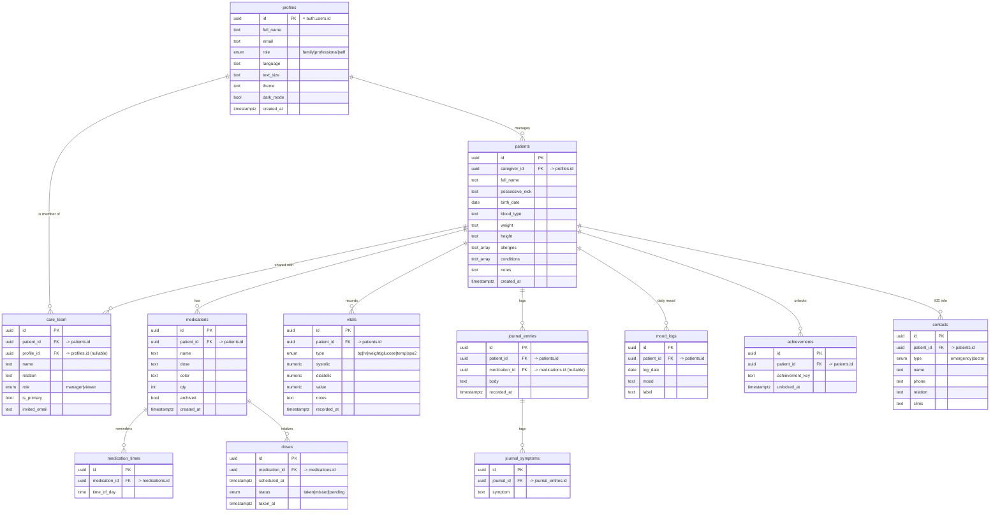

# MedTracker — Entity Relationship Diagram (ERD)

> Backend: **Supabase (PostgreSQL)**. Renders automatically on GitHub.
> Source of truth: [`schema.sql`](./schema.sql).

**Access control (RLS).** Every table is row-level-secured. A caregiver
(`profiles.id = auth.uid()`) can reach a row only if they own the patient
(`patients.caregiver_id`) or appear in that patient's `care_team`. This is
enforced by the `can_access_patient()` helper used in all policies — patient
medical data is never exposed across accounts.
